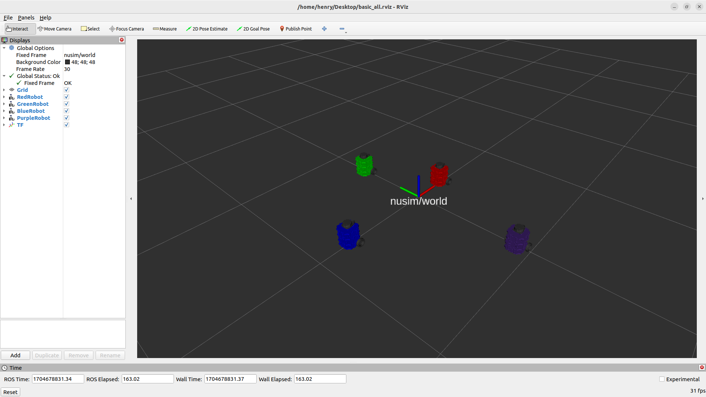
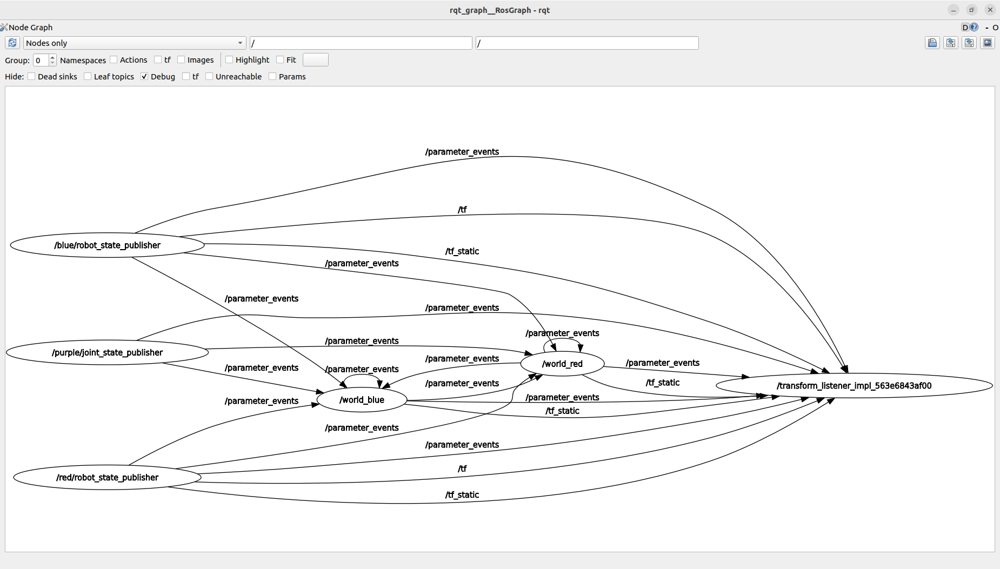

# Nuturtle  Description
URDF files for Nuturtle Snapper
* `ros2 launch nuturtle_description load_one.launch.py` to see the robot in rviz.
* `ros2 launch nuturtle_description load_all.launch.xml` to see four copies of the robot in rviz.


* The rqt_graph when all four robots are visualized (Nodes Only, Hide Debug) is:

# Launch File Details
* `ros2 launch nuturtle_description load_one.launch.py --show-args`
  ```
  Arguments (pass arguments as '<name>:=<value>'):

    'use_rviz':
        Specify whether rviz is launched. Valid choices are: ['true', 'false']
        (default: 'true')

    'use_jsp':
        Specify whether joint_state_publisher is used. Valid choices are: ['true', 'false']
        (default: 'true')

    'color':
        Determines color of the robot. Valid choices are: ['purple', 'red', 'green', 'blue', '']
        (default: 'purple')
    ```
* `ros2 launch nuturtle_description load_all.launch.xml --show-args`
  ```
  Arguments (pass arguments as '<name>:=<value>'):

    'use_rviz':
        Specify whether rviz is launched. Valid choices are: ['true', 'false']
        (default: 'true')

    'use_jsp':
        Specify whether joint_state_publisher is used. Valid choices are: ['true', 'false']
        (default: 'true')

    'color':
        Determines color of the robot. Valid choices are: ['purple', 'red', 'green', 'blue', '']
        (default: 'purple')
    ```